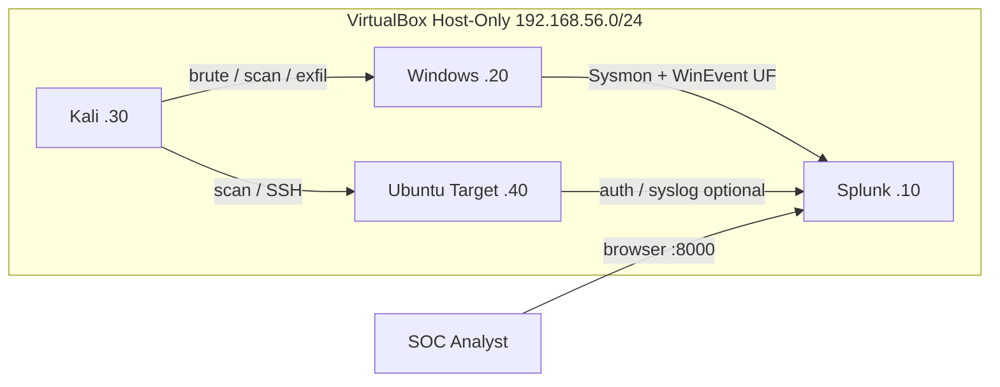

# Lab Architecture

## Overview

This lab models a small enterprise network monitored by a SIEM. Four VirtualBox guests share an isolated internal network so attacks never leave the host.

## Logical Diagram

```
┌──────────────────────────────────────────────────────────────────────────┐
│                        VirtualBox Host (Your PC)                         │
│                                                                          │
│   NIC: Host-Only Adapter  vboxnet0  →  192.168.56.1                      │
│                                                                          │
│  ┌────────────────┐  ┌────────────────┐  ┌────────────────┐  ┌─────────┐ │
│  │ Ubuntu SIEM    │  │ Windows 10     │  │ Kali Linux     │  │ Ubuntu  │ │
│  │ Splunk         │  │ Victim         │  │ Attacker       │  │ Target  │ │
│  │                │  │                │  │                │  │ Server  │ │
│  │ eth0: .10      │  │ eth0: .20      │  │ eth0: .30      │  │ eth:.40 │ │
│  │ Splunk :8000   │  │ Sysmon         │  │ Hydra/Nmap     │  │ SSH:22  │ │
│  │ SplunkD :9997  │  │ UF → :9997     │  │ Wireshark      │  │ HTTP:80 │ │
│  │ OpenVAS (opt)  │  │ RDP (lab only) │  │                │  │         │ │
│  └────────────────┘  └────────────────┘  └────────────────┘  └─────────┘ │
│           ▲ logs              │                    │ attacks              │
│           └───────────────────┴────────────────────┘                     │
└──────────────────────────────────────────────────────────────────────────┘
```

## Data Flow

```
Windows (Sysmon + Windows Event Log)
        │
        │  Splunk Universal Forwarder
        ▼
Ubuntu SIEM (Splunk Enterprise :9997 receive / :8000 UI)
        │
        ▼
Analyst searches, dashboards, alerts, IR reports
```

## Network Addressing

| Hostname | Role | IP | Gateway | DNS |
|----------|------|----|---------|-----|
| `soc-siem` | Splunk | 192.168.56.10 | 192.168.56.1 | 8.8.8.8 (optional) |
| `soc-victim` | Windows | 192.168.56.20 | 192.168.56.1 | 192.168.56.10 |
| `soc-attacker` | Kali | 192.168.56.30 | 192.168.56.1 | 8.8.8.8 |
| `soc-target` | Ubuntu target | 192.168.56.40 | 192.168.56.1 | 8.8.8.8 |

Subnet mask: `255.255.255.0`

## Firewall / Isolation Notes

- Prefer **Host-Only** or **Internal Network** for attack traffic.
- If guests need ISO downloads, use a second NIC on **NAT**, then disable it during attack exercises.
- Do not bridge the attack NIC to your home/office LAN.

## Ports Used in Lab

| Port | Service | Host |
|------|---------|------|
| 8000 | Splunk Web | SIEM |
| 8089 | Splunk management | SIEM |
| 9997 | Splunk receiving | SIEM |
| 22 | SSH | Target / SIEM |
| 80 | HTTP demo | Target |
| 3389 | RDP (optional) | Victim |
| 445 | SMB (optional lab share) | Victim |

## Mermaid (for GitHub rendering)



See also: [`network-diagram.md`](network-diagram.md) and [`ip-plan.md`](ip-plan.md).
